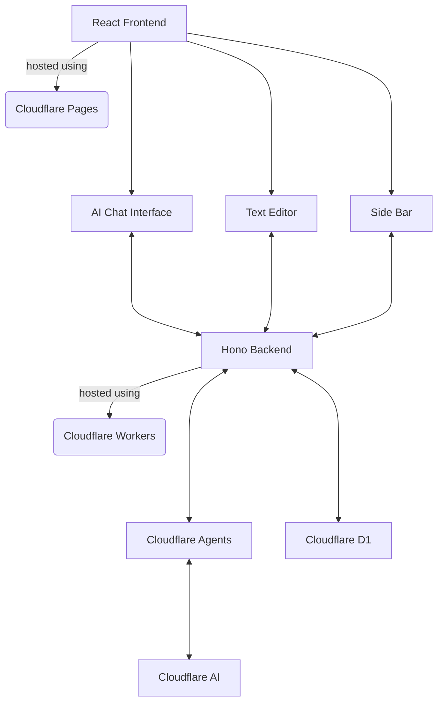

# Wraiter


[](https://opensource.org/licenses/MIT)

## A full-stack BHVR AI assisted writing app.

Try the live demo [here.](https://wraiter-9xs.pages.dev/).
Also, Check out my dev log [here](https://gist.github.com/haru-02/6972304c66d2d416ec579b63e55c3ed0) to know how it was designed, and for a detailed documentation.


## Why bhvr?

While there are plenty of existing app building stacks out there, many of them are either bloated, outdated, or have too much of a vendor lock-in. bhvr is built with the opinion that you should be able to deploy your client or server in any environment while also keeping type saftey. Also, I just wanted to try using hono for backend rather than following the MERN conventions which feels a bit restrictive, along with avoiding the few drawbacks that come with using npm.

## Features

- **Rich text editor** \- one that provides various styling options for your notes.
- **Save/delete** \- save/delete your notes across sessions.
- **AI** \- with the ollama model from meta, get the cutting edge help you need with your content.
- **pass context** \- pass your written text as context by including @writer in your prompt.

## Project Structure

```
.
├── client/               # React frontend
├── server/               # Hono backend
├── shared/               # Shared TypeScript definitions
│   └── src/types/        # Type definitions used by both client and server
└── package.json          # Root package.json with workspaces
```



### Server

bhvr uses Hono as a backend API for it's simplicity and massive ecosystem of plugins. If you have ever used Express then it might feel familiar. Declaring routes and returning data is easy.

```
server
├── bun.lock
├── package.json
├── README.md
├── src
│   └── index.ts
└── tsconfig.json
```

### Client

Uses some components from shadcn, and a few other self-defined styles.
Uses the React + vite framework

## Getting Started

### Installation

```bash
# Install dependencies for all workspaces
bun install
```

### Development

```bash
# Run shared types in watch mode, server, and client all at once
bun run dev

bun run dev:server  # Run the Hono backend
bun run dev:client  # Run the Vite dev server for React
```

### Building

```bash
# Build everything
bun run build

# Or build individual parts
bun run build:shared  # Build the shared types package
bun run build:client  # Build the React frontend
```
